# Design Document

## Overview

This design outlines the systematic approach to investigate, fix, and enable all commented modules in the ChemChat application, while creating comprehensive Swagger API documentation. The investigation reveals several modules are disabled due to missing dependencies, circular imports, and configuration issues.

### Project Infrastructure Analysis

The ChemChat project uses a comprehensive Docker-based development environment with:

- **Database**: PostgreSQL 15 with Prisma ORM
- **Cache/Session**: Redis 7 with password authentication
- **Search**: Elasticsearch 8.11 (single-node setup)
- **Message Queue**: Kafka with Zookeeper
- **Monitoring**: Prometheus, Grafana, Jaeger for observability
- **Development Tools**: Adminer, Redis Commander, Kafka UI, MailHog

### Development Workflow

The project provides several npm scripts for development:

- `npm run dev:setup` - Start complete development environment
- `npm run start:dev` - Start NestJS with hot reload
- `npm run prisma:migrate` - Run database migrations
- `npm run seed:database` - Seed test data
- `npm run swagger` - Generate Swagger documentation only

### Current Module Status

Based on app.module.ts analysis:

- **Enabled**: AuthModule, HealthModule, TenantModule, NotificationModule, MediaModule
- **Disabled**: ChatModule, PresenceModule, SearchModule, SyncModule, SecurityModule, ObservabilityModule

## Architecture

### Current Module Status Analysis

Based on investigation, the following modules are currently disabled:

1. **ChatModule** - Requires WebSocket setup, Kafka, and Outbox pattern
2. **PresenceModule** - Depends on ChatModule and WebSocket infrastructure
3. **SearchModule** - Requires Elasticsearch and Kafka integration
4. **SyncModule** - Has dependency issues with shared modules
5. **SecurityModule** - Redis method compatibility issues
6. **ObservabilityModule** - Requires additional monitoring setup

### Module Dependency Graph

```mermaid
graph TD
    A[AppModule] --> B[AuthModule]
    A --> C[HealthModule]
    A --> D[NotificationModule]
    A --> E[MediaModule]
    A --> F[TenantModule]

    G[ChatModule] --> H[PresenceModule]
    G --> I[KafkaModule]
    G --> J[OutboxModule]
    G --> K[CqrsModule]
    G --> L[SequenceModule]

    M[SearchModule] --> I
    M --> N[ElasticsearchService]

    O[SyncModule] --> P[SharedModule]
    O --> B

    Q[SecurityModule] --> R[RedisModule]

    S[ObservabilityModule] --> T[TracingService]
    S --> U[MetricsService]
```



## Components and Interfaces

### Module Enablement Strategy

#### Phase 1: Core Infrastructure

- Fix RedisModule compatibility issues
- Ensure SharedModule dependencies are resolved
- Enable SecurityModule with proper Redis integration

#### Phase 2: Messaging Infrastructure

- Set up KafkaModule with proper configuration
- Enable OutboxModule for event sourcing
- Configure CqrsModule for command/query separation

#### Phase 3: Real-time Features

- Enable PresenceModule with WebSocket support
- Enable ChatModule with full messaging capabilities
- Configure WebSocket authentication and authorization

#### Phase 4: Advanced Features

- Enable SearchModule with Elasticsearch integration
- Enable SyncModule for offline synchronization
- Enable ObservabilityModule for monitoring

### Swagger Documentation Strategy

#### API Documentation Structure

```typescript
interface SwaggerDocumentationPlan {
  authentication: {
    jwt: 'Bearer token authentication';
    tenantId: 'Multi-tenant identifier';
  };

  modules: {
    auth: 'Authentication and authorization endpoints';
    health: 'System health and status checks';
    tenant: 'Multi-tenant management';
    notification: 'Notification management';
    media: 'File upload and media handling';
    chat: 'Real-time messaging (when enabled)';
    presence: 'User presence and typing indicators';
    search: 'Message search and indexing';
    sync: 'Offline synchronization';
    security: 'Security policies and monitoring';
  };

  commonPatterns: {
    pagination: 'Cursor-based pagination';
    errorHandling: 'Consistent error response format';
    validation: 'Request validation with detailed errors';
    rateLimit: 'Rate limiting information';
  };
}
```

## Data Models

### Enhanced DTO Documentation

Each DTO will include:

- Field descriptions and validation rules
- Example values for testing
- Required/optional field indicators
- Relationship mappings for complex objects

### Error Response Schema

```typescript
interface ApiErrorResponse {
  statusCode: number;
  message: string | string[];
  error: string;
  timestamp: string;
  path: string;
  correlationId: string;
  details?: Record<string, any>;
}
```

### Pagination Schema

```typescript
interface PaginatedResponse<T> {
  data: T[];
  pagination: {
    total: number;
    page: number;
    limit: number;
    totalPages: number;
    hasNext: boolean;
    hasPrevious: boolean;
    nextCursor?: string;
    previousCursor?: string;
  };
}
```

## Error Handling

### Module-Specific Error Handling

1. **Dependency Resolution Errors**
   - Clear error messages for missing services
   - Graceful degradation when optional services unavailable
   - Proper module loading order

2. **Configuration Errors**
   - Environment variable validation
   - Service connection health checks
   - Fallback configurations for development

3. **Runtime Errors**
   - Circuit breaker patterns for external services
   - Retry mechanisms with exponential backoff
   - Proper error logging and correlation IDs

### API Error Standardization

All API endpoints will return consistent error formats with:

- HTTP status codes following REST conventions
- Detailed validation error messages
- Correlation IDs for request tracking
- Structured error objects for programmatic handling

## Testing Strategy

### Module Testing Approach

1. **Unit Tests**
   - Service layer testing with mocked dependencies
   - Controller testing with proper request/response validation
   - DTO validation testing

2. **Integration Tests**
   - Module integration with dependencies
   - Database integration testing
   - External service integration testing

3. **API Documentation Testing**
   - Swagger schema validation
   - Example request/response testing
   - Authentication flow testing

### Swagger Testing Features

1. **Interactive Testing**
   - Try-it-out functionality for all endpoints
   - Pre-filled example requests
   - Authentication token persistence

2. **Schema Validation**
   - Request/response schema validation
   - Parameter validation testing
   - Error response testing

## Implementation Phases

### Phase 1: Infrastructure Setup and Basic Fixes (Priority: High)

- Set up development environment using `npm run dev:setup`
- Fix RedisModule compatibility issues in SecurityModule
- Resolve SharedModule circular dependencies
- Enable SecurityModule with proper Redis integration

### Phase 2: Database and Core Services (Priority: High)

- Ensure Prisma migrations are up to date
- Configure KafkaModule for development environment
- Enable OutboxModule with proper database integration
- Test basic CRUD operations with existing modules

### Phase 3: Real-time Messaging Infrastructure (Priority: Medium)

- Enable PresenceModule with Redis-based presence tracking
- Configure WebSocket authentication and authorization
- Enable ChatModule with CQRS pattern and event sourcing
- Test WebSocket connections and message broadcasting

### Phase 4: Advanced Features (Priority: Medium)

- Enable SearchModule with Elasticsearch integration
- Configure message indexing and search capabilities
- Enable SyncModule for offline synchronization
- Test search functionality and conflict resolution

### Phase 5: Monitoring and Documentation (Priority: High)

- Enable ObservabilityModule with Jaeger tracing
- Complete Swagger documentation for all enabled modules
- Add interactive examples and comprehensive error documentation
- Test all APIs through Swagger interface

### Development Environment Commands

```bash
# Start complete development environment
npm run dev:setup

# Check service status
npm run dev:status

# View application logs
npm run dev:logs

# Run database migrations
npm run dev:migrate

# Seed test data
npm run dev:seed

# Access application shell
npm run dev:shell

# Stop all services
npm run dev:stop
```
