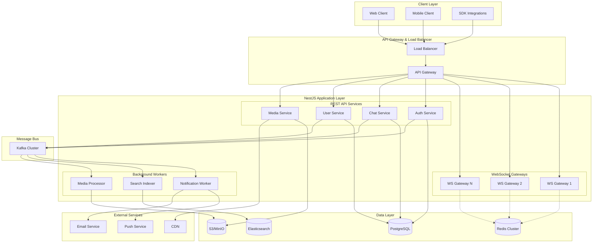
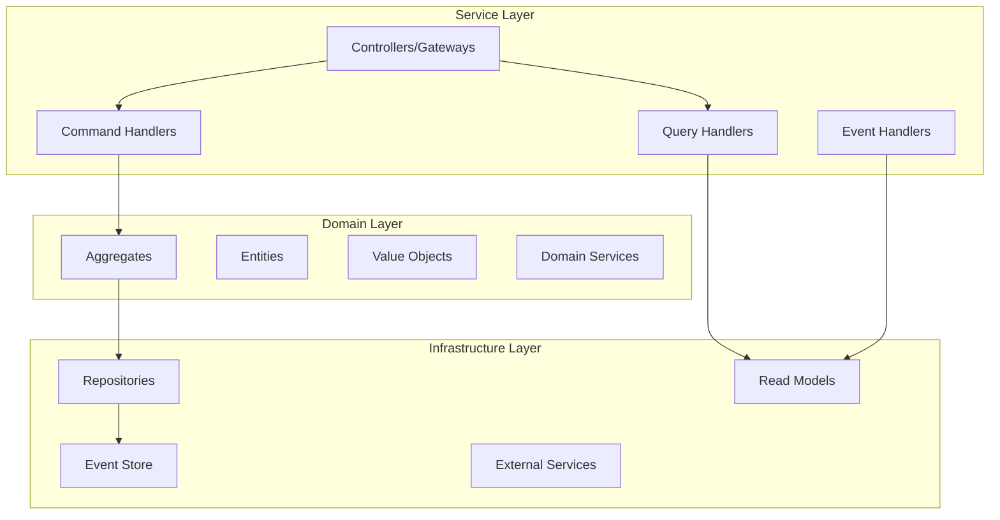
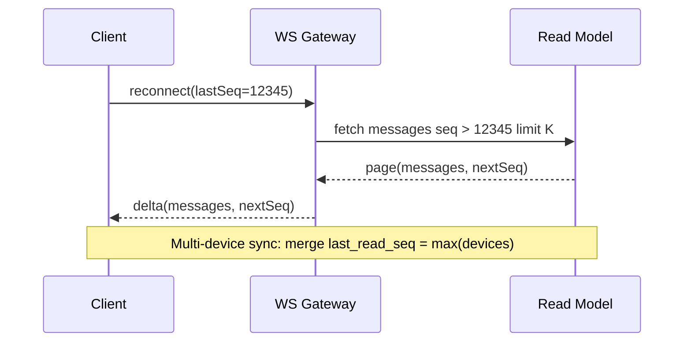
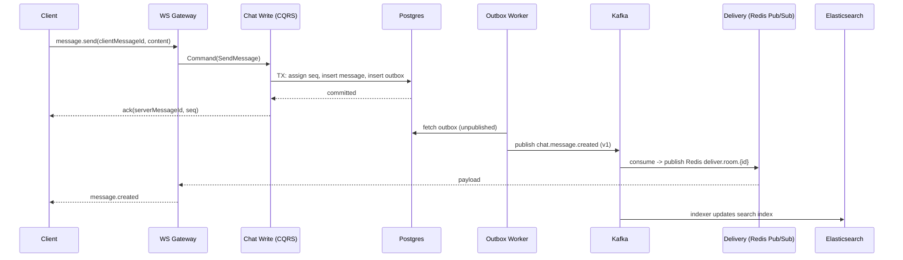
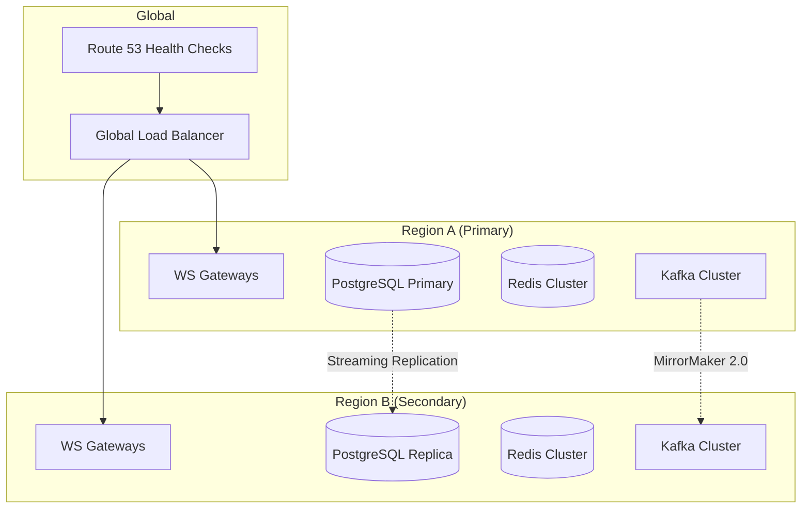
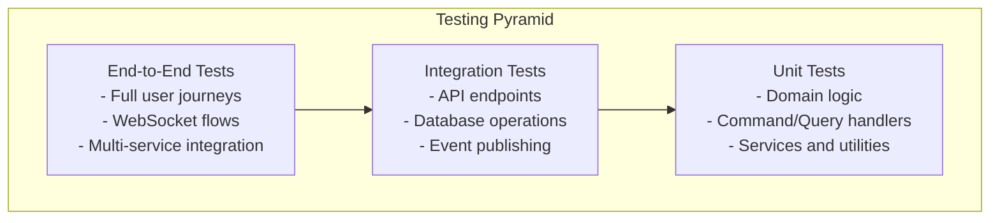

# Design Document: Real-Time Chat System

## Overview

This document outlines the architecture and design for a scalable, production-ready real-time chat system built on NestJS. The system is designed to handle millions of concurrent users through horizontal scaling, event-driven architecture, and strategic use of multiple data stores.

### Key Design Principles

- **Event-Driven Architecture**: CQRS with CommandBus and EventBus for scalability
- **Horizontal Scalability**: Stateless services with Redis-based coordination
- **Data Consistency**: Outbox pattern with Kafka for reliable event distribution
- **Message Ordering**: Monotonic sequence numbers per conversation with idempotency
- **Performance**: Read models and caching for optimal query performance
- **Reliability**: Circuit breakers, retries, and graceful degradation
- **Security**: Defense in depth with encryption, authentication, and authorization
- **Observability**: End-to-end tracing with OpenTelemetry and SLO monitoring

## Architecture

### High-Level Architecture



### Service Architecture Pattern

Each service follows a layered architecture:



## Components and Interfaces

### Core Modules

#### 1. Authentication Module (`auth`)

**Responsibilities:**

- JWT token management (access, refresh, WebSocket tokens)
- Multi-factor authentication
- Device management and binding
- Token revocation and rotation

**Key Components:**

```typescript
// Core interfaces
interface AuthService {
  authenticate(credentials: LoginDto): Promise<AuthResult>;
  refreshToken(refreshToken: string): Promise<TokenPair>;
  generateWebSocketToken(userId: string): Promise<string>;
  revokeToken(tokenId: string): Promise<void>;
  enableMFA(userId: string, secret: string): Promise<void>;
}

interface TokenService {
  generateTokenPair(user: User): Promise<TokenPair>;
  validateToken(token: string): Promise<TokenPayload>;
  revokeToken(tokenId: string): Promise<void>;
}
```

#### 2. Chat Module (`chat`)

**Responsibilities:**

- Message CRUD operations
- Conversation management
- Real-time message distribution
- Message ordering and consistency

**Key Components:**

```typescript
// Command handlers
interface MessageCommandHandler {
  sendMessage(command: SendMessageCommand): Promise<void>;
  editMessage(command: EditMessageCommand): Promise<void>;
  deleteMessage(command: DeleteMessageCommand): Promise<void>;
  addReaction(command: AddReactionCommand): Promise<void>;
}

// Query handlers
interface MessageQueryHandler {
  getConversationHistory(query: GetHistoryQuery): Promise<MessagePage>;
  searchMessages(query: SearchMessagesQuery): Promise<SearchResult>;
}

// WebSocket Gateway
interface ChatGateway {
  handleMessage(client: Socket, payload: SendMessageDto): Promise<void>;
  handleTyping(client: Socket, payload: TypingDto): Promise<void>;
  handleJoinRoom(client: Socket, payload: JoinRoomDto): Promise<void>;
}
```

#### 3. Presence Module (`presence`)

**Responsibilities:**

- Online/offline status tracking
- Typing indicators
- Heartbeat management
- Multi-device presence

**Key Components:**

```typescript
interface PresenceService {
  setUserOnline(userId: string, deviceId: string): Promise<void>;
  setUserOffline(userId: string, deviceId: string): Promise<void>;
  getUserPresence(userId: string): Promise<PresenceStatus>;
  startTyping(userId: string, conversationId: string): Promise<void>;
  stopTyping(userId: string, conversationId: string): Promise<void>;
}

interface HeartbeatService {
  registerHeartbeat(userId: string, deviceId: string): Promise<void>;
  checkStaleConnections(): Promise<void>;
}
```

#### 4. Notification Module (`notification`)

**Responsibilities:**

- Push notification delivery
- Email fallback notifications
- Notification preferences
- Delivery tracking

**Key Components:**

```typescript
interface NotificationService {
  sendPushNotification(notification: PushNotificationDto): Promise<void>;
  sendEmailNotification(notification: EmailNotificationDto): Promise<void>;
  getUserPreferences(userId: string): Promise<NotificationPreferences>;
  markAsDelivered(notificationId: string): Promise<void>;
}
```

### Data Access Layer

#### Repository Pattern Implementation

```typescript
// Base repository interface
interface BaseRepository<T, ID> {
  findById(id: ID): Promise<T | null>;
  save(entity: T): Promise<T>;
  delete(id: ID): Promise<void>;
  findAll(criteria: QueryCriteria): Promise<T[]>;
}

// Specific repositories
interface MessageRepository extends BaseRepository<Message, string> {
  findByConversationId(
    conversationId: string,
    pagination: Pagination,
  ): Promise<MessagePage>;
  findBySequenceRange(
    conversationId: string,
    fromSeq: number,
    toSeq: number,
  ): Promise<Message[]>;
}

interface ConversationRepository extends BaseRepository<Conversation, string> {
  findByUserId(userId: string): Promise<Conversation[]>;
  findMembers(conversationId: string): Promise<ConversationMember[]>;
}
```

## Data Models

### Message Ordering and Idempotency

#### Sequence Number Generation

```typescript
// Prefer Redis INCR for sequence generation with DB fallback
class SequenceService {
  async getNextSequence(conversationId: string): Promise<number> {
    try {
      // Primary: Redis atomic increment
      return await this.redis.incr(`seq:${conversationId}`);
    } catch (error) {
      // Fallback: Database with row-level locking
      const result = await this.db.query(
        'UPDATE conversation_state SET last_seq = last_seq + 1 WHERE conversation_id = $1 RETURNING last_seq',
        [conversationId],
      );
      return result.rows[0].last_seq;
    }
  }
}
```

#### Client Reconnection and Delta Sync



#### End-to-End Message Flow



### PostgreSQL Schema

```sql
-- Users table
CREATE TABLE users (
    id UUID PRIMARY KEY DEFAULT gen_random_uuid(),
    username VARCHAR(50) UNIQUE NOT NULL,
    display_name VARCHAR(100) NOT NULL,
    email VARCHAR(255) UNIQUE NOT NULL,
    password_hash VARCHAR(255) NOT NULL,
    mfa_enabled BOOLEAN DEFAULT FALSE,
    mfa_secret VARCHAR(255),
    created_at TIMESTAMP WITH TIME ZONE DEFAULT NOW(),
    updated_at TIMESTAMP WITH TIME ZONE DEFAULT NOW()
);

-- Conversations table
CREATE TABLE conversations (
    id UUID PRIMARY KEY DEFAULT gen_random_uuid(),
    type VARCHAR(20) NOT NULL CHECK (type IN ('dm', 'group')),
    name VARCHAR(100),
    owner_id UUID REFERENCES users(id),
    created_at TIMESTAMP WITH TIME ZONE DEFAULT NOW(),
    updated_at TIMESTAMP WITH TIME ZONE DEFAULT NOW()
);

-- Conversation members with roles
CREATE TABLE conversation_members (
    conversation_id UUID REFERENCES conversations(id) ON DELETE CASCADE,
    user_id UUID REFERENCES users(id) ON DELETE CASCADE,
    role VARCHAR(20) NOT NULL DEFAULT 'member' CHECK (role IN ('owner', 'admin', 'member')),
    last_read_message_id UUID,
    last_read_sequence BIGINT DEFAULT 0,
    joined_at TIMESTAMP WITH TIME ZONE DEFAULT NOW(),
    PRIMARY KEY (conversation_id, user_id)
);

-- Messages with sequence ordering
CREATE TABLE messages (
    id UUID PRIMARY KEY DEFAULT gen_random_uuid(),
    conversation_id UUID REFERENCES conversations(id) ON DELETE CASCADE,
    sender_id UUID REFERENCES users(id),
    client_message_id VARCHAR(100),
    sequence_number BIGINT NOT NULL,
    message_type VARCHAR(20) NOT NULL DEFAULT 'text' CHECK (message_type IN ('text', 'image', 'file', 'system')),
    content JSONB NOT NULL,
    edited_at TIMESTAMP WITH TIME ZONE,
    deleted_at TIMESTAMP WITH TIME ZONE,
    created_at TIMESTAMP WITH TIME ZONE DEFAULT NOW(),
    UNIQUE(conversation_id, sequence_number),
    UNIQUE(conversation_id, client_message_id, sender_id)
);

-- Message reactions
CREATE TABLE message_reactions (
    message_id UUID REFERENCES messages(id) ON DELETE CASCADE,
    user_id UUID REFERENCES users(id) ON DELETE CASCADE,
    emoji VARCHAR(10) NOT NULL,
    created_at TIMESTAMP WITH TIME ZONE DEFAULT NOW(),
    PRIMARY KEY (message_id, user_id, emoji)
);

-- Conversation state for sequence fallback
CREATE TABLE conversation_state (
    conversation_id UUID PRIMARY KEY REFERENCES conversations(id) ON DELETE CASCADE,
    last_seq BIGINT NOT NULL DEFAULT 0,
    updated_at TIMESTAMP WITH TIME ZONE DEFAULT NOW()
);

-- Media attachments (separate from message content)
CREATE TABLE attachments (
    id UUID PRIMARY KEY DEFAULT gen_random_uuid(),
    message_id UUID REFERENCES messages(id) ON DELETE CASCADE,
    filename VARCHAR(255) NOT NULL,
    mime_type VARCHAR(100) NOT NULL,
    file_size BIGINT NOT NULL,
    file_hash VARCHAR(64) NOT NULL,
    storage_url TEXT NOT NULL,
    thumbnail_url TEXT,
    created_at TIMESTAMP WITH TIME ZONE DEFAULT NOW()
);

-- Audit logs for compliance and moderation
CREATE TABLE audit_logs (
    id UUID PRIMARY KEY DEFAULT gen_random_uuid(),
    tenant_id UUID, -- For multi-tenancy
    actor_id UUID REFERENCES users(id),
    action VARCHAR(50) NOT NULL,
    target_type VARCHAR(50) NOT NULL,
    target_id UUID NOT NULL,
    metadata JSONB,
    ip_address INET,
    user_agent TEXT,
    created_at TIMESTAMP WITH TIME ZONE DEFAULT NOW()
);

-- Outbox pattern for reliable event publishing
CREATE TABLE outbox_events (
    id UUID PRIMARY KEY DEFAULT gen_random_uuid(),
    tenant_id UUID, -- For multi-tenancy
    aggregate_type VARCHAR(50) NOT NULL,
    aggregate_id UUID NOT NULL,
    event_type VARCHAR(100) NOT NULL,
    event_data JSONB NOT NULL,
    created_at TIMESTAMP WITH TIME ZONE DEFAULT NOW(),
    published_at TIMESTAMP WITH TIME ZONE,
    retry_count INTEGER DEFAULT 0
);

-- Partitioning for massive scale (example: by time)
-- CREATE TABLE messages_2024_01 PARTITION OF messages
-- FOR VALUES FROM ('2024-01-01') TO ('2024-02-01');

-- Indexes for performance
CREATE INDEX idx_messages_conversation_sequence ON messages(conversation_id, sequence_number DESC);
CREATE INDEX idx_messages_created_at ON messages(created_at DESC);
CREATE UNIQUE INDEX idx_conversation_members_unique ON conversation_members(conversation_id, user_id);
CREATE INDEX idx_conversation_members_user ON conversation_members(user_id);
CREATE INDEX idx_outbox_unpublished ON outbox_events(created_at) WHERE published_at IS NULL;
CREATE INDEX idx_audit_logs_actor ON audit_logs(actor_id, created_at DESC);
CREATE INDEX idx_attachments_message ON attachments(message_id);
```

### Redis Data Structures

```typescript
// Presence data structures
interface PresenceData {
  status: 'online' | 'offline' | 'away';
  lastSeen: number;
  devices: DeviceInfo[];
}

// Redis keys and structures
const REDIS_KEYS = {
  // Presence: presence:user:{userId}
  userPresence: (userId: string) => `presence:user:${userId}`,

  // Socket connections: conn:user:{userId} -> Set<socketId>
  userConnections: (userId: string) => `conn:user:${userId}`,

  // Room members: room:members:{roomId} -> Set<userId>
  roomMembers: (roomId: string) => `room:members:${roomId}`,

  // Socket rooms: socket:rooms:{socketId} -> Set<roomId>
  socketRooms: (socketId: string) => `socket:rooms:${socketId}`,

  // Typing indicators: typing:{roomId} -> Set<userId> with TTL
  typing: (roomId: string) => `typing:${roomId}`,

  // Rate limiting: rate:{userId}:{action} -> counter with TTL
  rateLimit: (userId: string, action: string) => `rate:${userId}:${action}`,

  // Sequence numbers: seq:{conversationId} -> counter
  sequence: (conversationId: string) => `seq:${conversationId}`,
};
```

### Rate Limiting and Backpressure

```typescript
// Token bucket implementation using Redis
class RateLimiter {
  async checkLimit(
    userId: string,
    action: string,
    limit: number,
    windowMs: number,
  ): Promise<boolean> {
    const key = `rate:${userId}:${action}`;
    const now = Date.now();

    const script = `
      local key = KEYS[1]
      local limit = tonumber(ARGV[1])
      local window = tonumber(ARGV[2])
      local now = tonumber(ARGV[3])
      
      local current = redis.call('HMGET', key, 'tokens', 'resetAt')
      local tokens = tonumber(current[1]) or limit
      local resetAt = tonumber(current[2]) or now
      
      if now >= resetAt then
        tokens = limit
        resetAt = now + window
      end
      
      if tokens > 0 then
        tokens = tokens - 1
        redis.call('HMSET', key, 'tokens', tokens, 'resetAt', resetAt)
        redis.call('EXPIRE', key, math.ceil(window / 1000))
        return 1
      else
        return 0
      end
    `;

    const result = await this.redis.eval(script, 1, key, limit, windowMs, now);
    return result === 1;
  }
}
```

### Elasticsearch Schema with Multi-language Support

```json
{
  "settings": {
    "number_of_shards": 5,
    "number_of_replicas": 1,
    "index.lifecycle.name": "messages-policy",
    "analysis": {
      "analyzer": {
        "multilang_analyzer": {
          "type": "custom",
          "tokenizer": "icu_tokenizer",
          "filter": ["icu_folding", "icu_normalizer", "lowercase", "stop"]
        }
      }
    }
  },
  "mappings": {
    "properties": {
      "messageId": { "type": "keyword" },
      "conversationId": { "type": "keyword" },
      "senderId": { "type": "keyword" },
      "tenantId": { "type": "keyword" },
      "content": {
        "type": "text",
        "analyzer": "multilang_analyzer",
        "fields": {
          "keyword": { "type": "keyword" },
          "ngram": {
            "type": "text",
            "analyzer": "ngram_analyzer"
          }
        }
      },
      "messageType": { "type": "keyword" },
      "timestamp": { "type": "date" },
      "editedAt": { "type": "date" },
      "deleted": { "type": "boolean" },
      "sequenceNumber": { "type": "long" }
    }
  }
}
```

### Index Lifecycle Management (ILM) Policy

```json
{
  "policy": {
    "phases": {
      "hot": {
        "actions": {
          "rollover": {
            "max_size": "50gb",
            "max_age": "7d"
          },
          "set_priority": {
            "priority": 100
          }
        }
      },
      "warm": {
        "min_age": "30d",
        "actions": {
          "forcemerge": {
            "max_num_segments": 1
          },
          "set_priority": {
            "priority": 50
          }
        }
      },
      "cold": {
        "min_age": "180d",
        "actions": {
          "freeze": {},
          "set_priority": {
            "priority": 0
          }
        }
      },
      "delete": {
        "min_age": "365d",
        "actions": {
          "delete": {}
        }
      }
    }
  }
}
```

## Security and Compliance

### Security Architecture

```typescript
// Multi-factor authentication
interface MFAService {
  generateSecret(userId: string): Promise<string>;
  verifyTOTP(userId: string, token: string): Promise<boolean>;
  requireMFAForAction(action: string): boolean;
}

// Device binding for refresh tokens
interface DeviceService {
  bindRefreshToken(userId: string, deviceFingerprint: string): Promise<string>;
  validateDeviceBinding(
    refreshToken: string,
    deviceFingerprint: string,
  ): Promise<boolean>;
  revokeDeviceTokens(userId: string, deviceId: string): Promise<void>;
}

// Token revocation list
interface TokenRevocationService {
  revokeToken(tokenId: string): Promise<void>;
  isTokenRevoked(tokenId: string): Promise<boolean>;
  cleanupExpiredTokens(): Promise<void>;
}
```

### Data Protection and Compliance

```typescript
// GDPR compliance service
interface ComplianceService {
  exportUserData(userId: string): Promise<UserDataExport>;
  deleteUserData(userId: string): Promise<void>;
  anonymizeUserData(userId: string): Promise<void>;
  applyRetentionPolicy(tenantId: string): Promise<void>;
}

// Encryption at rest configuration
const encryptionConfig = {
  database: 'AES-256-GCM via KMS',
  redis: 'TLS + AUTH',
  elasticsearch: 'X-Pack Security',
  s3: 'SSE-KMS with customer managed keys',
};
```

## Reliability and Disaster Recovery

### Service Level Objectives (SLOs)

```typescript
const SLOs = {
  messageDelivery: {
    latency: 'p95 ≤ 250ms in-region',
    availability: '99.9% uptime',
    durability: '99.999% message delivery',
  },
  queryPerformance: {
    recentMessages: 'p95 ≤ 150ms',
    search: 'p95 ≤ 500ms',
    presence: 'p95 ≤ 100ms',
  },
  recovery: {
    rpo: '≤ 5 minutes',
    rto: '≤ 15 minutes',
  },
};
```

### Multi-Region Architecture (Optional)



### Graceful Degradation Strategy

```typescript
class DegradationService {
  async handleServiceDegradation(service: string, healthScore: number) {
    if (healthScore < 0.5) {
      switch (service) {
        case 'kafka':
          // Shed non-critical events (typing, reactions)
          await this.disableNonCriticalEvents();
          break;
        case 'elasticsearch':
          // Disable search, use cached results
          await this.enableSearchFallback();
          break;
        case 'redis':
          // Use database for presence, disable typing indicators
          await this.fallbackToDatabase();
          break;
      }
    }
  }
}
```

## API Contracts and Versioning

### OpenAPI and WebSocket Contracts

```typescript
// Versioned WebSocket events
interface WebSocketEvent {
  version: string; // e.g., "v1.chat.message.created"
  type: string;
  data: unknown;
  timestamp: number;
  correlationId: string;
}

// Schema registry for event evolution
interface EventSchema {
  version: string;
  schema: JSONSchema;
  compatibility: 'backward' | 'forward' | 'full';
}
```

### Feature Flags and Rollout

```typescript
interface FeatureFlagService {
  isEnabled(flag: string, userId?: string, tenantId?: string): Promise<boolean>;
  rolloutPercentage(flag: string, percentage: number): Promise<void>;
  enableForTenant(flag: string, tenantId: string): Promise<void>;
}
```

## Observability and Monitoring

### OpenTelemetry Integration

```typescript
// Trace propagation in WebSocket frames
interface WebSocketMessage {
  event: string;
  data: unknown;
  traceContext?: {
    traceId: string;
    spanId: string;
    traceFlags: number;
  };
}

// Custom metrics for chat system
const metrics = {
  socketConnections: 'chat_socket_connections_total',
  messagesPerSecond: 'chat_messages_per_second',
  outboxLag: 'chat_outbox_lag_seconds',
  kafkaConsumerLag: 'chat_kafka_consumer_lag',
  droppedEvents: 'chat_dropped_events_total',
};
```

### Alerting Rules

```yaml
# Prometheus alerting rules
groups:
  - name: chat.rules
    rules:
      - alert: HighMessageLatency
        expr: histogram_quantile(0.95, chat_message_latency_seconds) > 0.25
        for: 2m
        labels:
          severity: warning
        annotations:
          summary: 'High message delivery latency'

      - alert: OutboxLagHigh
        expr: chat_outbox_lag_seconds > 30
        for: 1m
        labels:
          severity: critical
        annotations:
          summary: 'Outbox processing lag is high'
```

## Error Handling

### Error Classification

```typescript
// Domain errors
abstract class DomainError extends Error {
  abstract readonly code: string;
  abstract readonly statusCode: number;
}

class ValidationError extends DomainError {
  readonly code = 'VALIDATION_ERROR';
  readonly statusCode = 400;
}

class UnauthorizedError extends DomainError {
  readonly code = 'UNAUTHORIZED';
  readonly statusCode = 401;
}

class ConversationNotFoundError extends DomainError {
  readonly code = 'CONVERSATION_NOT_FOUND';
  readonly statusCode = 404;
}

class RateLimitExceededError extends DomainError {
  readonly code = 'RATE_LIMIT_EXCEEDED';
  readonly statusCode = 429;
}
```

### Global Exception Filter

```typescript
@Catch()
export class GlobalExceptionFilter implements ExceptionFilter {
  catch(exception: unknown, host: ArgumentsHost) {
    const ctx = host.switchToHttp();
    const response = ctx.getResponse();
    const request = ctx.getRequest();

    let status = 500;
    let message = 'Internal server error';
    let code = 'INTERNAL_ERROR';

    if (exception instanceof DomainError) {
      status = exception.statusCode;
      message = exception.message;
      code = exception.code;
    }

    // Log error with correlation ID
    this.logger.error({
      correlationId: request.correlationId,
      error: exception,
      path: request.url,
      method: request.method,
    });

    response.status(status).json({
      code,
      message,
      timestamp: new Date().toISOString(),
      path: request.url,
      correlationId: request.correlationId,
    });
  }
}
```

### Circuit Breaker Pattern

```typescript
@Injectable()
export class CircuitBreakerService {
  private breakers = new Map<string, CircuitBreaker>();

  async execute<T>(
    key: string,
    operation: () => Promise<T>,
    options: CircuitBreakerOptions = {},
  ): Promise<T> {
    const breaker = this.getOrCreateBreaker(key, options);
    return breaker.execute(operation);
  }

  private getOrCreateBreaker(
    key: string,
    options: CircuitBreakerOptions,
  ): CircuitBreaker {
    if (!this.breakers.has(key)) {
      this.breakers.set(
        key,
        new CircuitBreaker({
          failureThreshold: options.failureThreshold || 5,
          resetTimeout: options.resetTimeout || 30000,
          monitoringPeriod: options.monitoringPeriod || 10000,
        }),
      );
    }
    return this.breakers.get(key)!;
  }
}
```

## Testing Strategy

### Testing Pyramid



### Test Categories

#### 1. Unit Tests

- Domain entities and value objects
- Command and query handlers
- Service layer logic
- Utility functions

```typescript
describe('SendMessageCommandHandler', () => {
  it('should create message with sequence number', async () => {
    // Arrange
    const command = new SendMessageCommand(conversationId, senderId, content);
    const mockRepo = createMockRepository();
    const handler = new SendMessageCommandHandler(mockRepo, eventBus);

    // Act
    await handler.handle(command);

    // Assert
    expect(mockRepo.save).toHaveBeenCalledWith(
      expect.objectContaining({
        sequenceNumber: expect.any(Number),
        content: content,
      }),
    );
  });
});
```

#### 2. Integration Tests

- REST API endpoints
- WebSocket gateway events
- Database operations
- Event publishing and consumption

```typescript
describe('ChatController (Integration)', () => {
  it('should send message and publish event', async () => {
    // Arrange
    const app = await createTestApp();
    const user = await createTestUser();
    const conversation = await createTestConversation();

    // Act
    const response = await request(app.getHttpServer())
      .post(`/conversations/${conversation.id}/messages`)
      .set('Authorization', `Bearer ${user.token}`)
      .send({ content: 'Hello world' });

    // Assert
    expect(response.status).toBe(201);
    expect(eventBus.publish).toHaveBeenCalledWith(
      expect.any(MessageCreatedEvent),
    );
  });
});
```

#### 3. End-to-End Tests

- Complete user workflows
- Multi-client scenarios
- Real-time communication flows

```typescript
describe('Real-time messaging (E2E)', () => {
  it('should deliver message to all room participants', async () => {
    // Arrange
    const [client1, client2] = await createWebSocketClients(2);
    const room = await createTestRoom();
    await Promise.all([client1.joinRoom(room.id), client2.joinRoom(room.id)]);

    // Act
    await client1.sendMessage(room.id, 'Hello everyone!');

    // Assert
    const message = await client2.waitForMessage();
    expect(message.content).toBe('Hello everyone!');
  });
});
```

### Load Testing

```typescript
// k6 load test script
import ws from 'k6/ws';
import { check } from 'k6';

export const options = {
  stages: [
    { duration: '2m', target: 1000 }, // Ramp up
    { duration: '5m', target: 1000 }, // Stay at 1000 users
    { duration: '2m', target: 10000 }, // Ramp up to 10k
    { duration: '10m', target: 10000 }, // Stay at 10k
    { duration: '2m', target: 0 }, // Ramp down
  ],
};

export default function () {
  const url = 'ws://localhost:3000/chat';
  const params = { headers: { Authorization: `Bearer ${__ENV.TOKEN}` } };

  ws.connect(url, params, (socket) => {
    socket.on('open', () => {
      socket.send(
        JSON.stringify({
          event: 'joinRoom',
          data: { roomId: 'test-room' },
        }),
      );
    });

    socket.on('message', (data) => {
      const message = JSON.parse(data);
      check(message, {
        'message received': (msg) => msg.event === 'message',
      });
    });

    // Send message every 5 seconds
    socket.setInterval(() => {
      socket.send(
        JSON.stringify({
          event: 'sendMessage',
          data: {
            roomId: 'test-room',
            content: `Message from user ${__VU} at ${Date.now()}`,
          },
        }),
      );
    }, 5000);
  });
}
```

## Production Deployment Considerations

### Kubernetes Configuration

```yaml
# HPA based on custom metrics
apiVersion: autoscaling/v2
kind: HorizontalPodAutoscaler
metadata:
  name: chat-gateway-hpa
spec:
  scaleTargetRef:
    apiVersion: apps/v1
    kind: Deployment
    name: chat-gateway
  minReplicas: 3
  maxReplicas: 100
  metrics:
    - type: Pods
      pods:
        metric:
          name: socket_connections_per_pod
        target:
          type: AverageValue
          averageValue: '1000'
```

### Zero-Downtime Deployment Strategy

```typescript
// Database migration strategy: Expand-Migrate-Contract
class MigrationStrategy {
  // Phase 1: Expand - Add new columns/tables
  async expandSchema() {
    await this.db.query('ALTER TABLE messages ADD COLUMN new_field TEXT');
  }

  // Phase 2: Migrate - Dual write to old and new
  async dualWrite() {
    // Application writes to both old and new fields
  }

  // Phase 3: Contract - Remove old columns/tables
  async contractSchema() {
    await this.db.query('ALTER TABLE messages DROP COLUMN old_field');
  }
}
```

### Performance Optimization Patterns

```typescript
// DataLoader pattern for N+1 query prevention
class MessageDataLoader {
  private conversationLoader = new DataLoader(
    async (conversationIds: string[]) => {
      const conversations =
        await this.conversationRepo.findByIds(conversationIds);
      return conversationIds.map((id) =>
        conversations.find((c) => c.id === id),
      );
    },
  );

  private memberLoader = new DataLoader(async (conversationIds: string[]) => {
    const members =
      await this.memberRepo.findByConversationIds(conversationIds);
    return conversationIds.map((id) =>
      members.filter((m) => m.conversationId === id),
    );
  });
}

// Cursor-based pagination using sequence numbers
interface PaginationCursor {
  conversationId: string;
  sequence: number;
  direction: 'before' | 'after';
  limit: number;
}
```

### Critical Algorithms and Thresholds

```typescript
const SYSTEM_THRESHOLDS = {
  // Presence and heartbeat
  heartbeatInterval: 30000, // 30 seconds
  presenceTimeout: 60000, // 2x heartbeat interval

  // Typing indicators
  typingTTL: 5000, // 5 seconds
  typingBatchInterval: 1000, // Emit every 1 second

  // Rate limiting
  messagesPerMinute: 60,
  connectionsPerUser: 5,
  roomMembersMax: 10000,

  // Hot room sharding
  hotRoomThreshold: 1000, // Members count
  shardCount: 16, // Fan-out shards

  // Backpressure
  outboxMaxSize: 10000,
  queueDepthWarning: 1000,

  // Conflict resolution
  editConflictWindow: 300000, // 5 minutes
};
```

This comprehensive design now addresses all production-scale requirements including:

- **Message ordering and idempotency** with Redis-based sequence generation
- **Client synchronization** with delta sync and multi-device support
- **Rate limiting and backpressure** with token bucket algorithms
- **Enhanced search** with multi-language support and ILM policies
- **Security and compliance** with MFA, device binding, and GDPR support
- **Reliability and DR** with clear SLOs, multi-region support, and graceful degradation
- **API versioning** with schema registry and feature flags
- **Comprehensive observability** with OpenTelemetry and custom metrics
- **Production deployment** patterns with K8s, zero-downtime migrations, and performance optimizations

The design is now ready for implementation at massive scale with enterprise-grade operational requirements.
