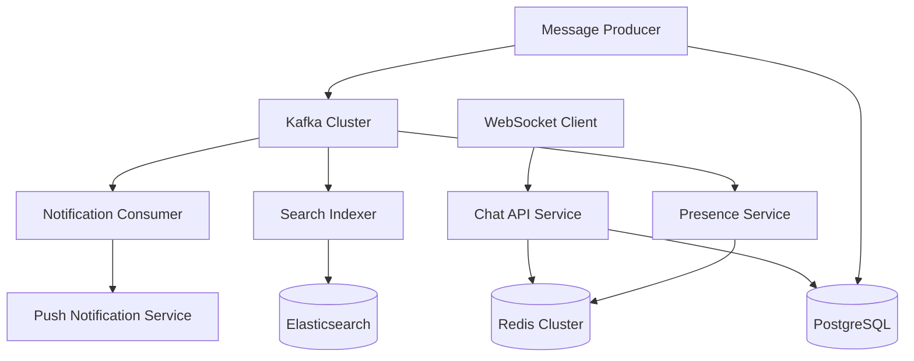

# ChemChat Production Deployment Architecture

## Microservices Breakdown

### 1. **Chat API Service** (chat-api)
```yaml
# Handles WebSocket connections and REST API
replicas: 3-10 (HPA based on connections)
resources:
  cpu: 500m-2000m
  memory: 512Mi-2Gi
```

### 2. **Message Producer Service** (message-producer)
```yaml
# Outbox pattern worker - publishes to Kafka
replicas: 2-5 (HPA based on outbox queue depth)
resources:
  cpu: 200m-1000m
  memory: 256Mi-1Gi
```

### 3. **Notification Consumer Service** (notification-consumer)
```yaml
# Consumes message events, sends notifications
replicas: 2-4
resources:
  cpu: 100m-500m
  memory: 128Mi-512Mi
```

### 4. **Search Indexer Service** (search-indexer)
```yaml
# Consumes message events, updates Elasticsearch
replicas: 1-3
resources:
  cpu: 200m-800m
  memory: 256Mi-1Gi
```

### 5. **Presence Service** (presence-service)
```yaml
# Handles typing indicators and user presence
replicas: 2-4
resources:
  cpu: 100m-500m
  memory: 128Mi-512Mi
```

## Kafka Topics Strategy

### Message Flow Topics:
- `chat.messages.v1` (partitioned by conversationId)
- `chat.conversations.v1` (partitioned by conversationId)  
- `chat.users.v1` (partitioned by userId)
- `presence.status.v1` (partitioned by userId)
- `presence.typing.v1` (partitioned by conversationId)

### Dead Letter Queues:
- `dlq.chat.messages.v1`
- `dlq.notifications.v1`
- `dlq.search.indexing.v1`

## Service Communication



## Deployment Commands

### Development (Docker Compose):
```bash
# All services in one compose file
docker-compose up -d
```

### Production (Kubernetes):
```bash
# Deploy each service separately
kubectl apply -f k8s/chat-api/
kubectl apply -f k8s/message-producer/
kubectl apply -f k8s/notification-consumer/
kubectl apply -f k8s/search-indexer/
kubectl apply -f k8s/presence-service/
```

## Environment-specific Configuration

### Development:
- Single Kafka broker
- Single Redis instance
- Shared database

### Production:
- Kafka cluster (3+ brokers)
- Redis cluster (6+ nodes)
- Database with read replicas
- Separate services with HPA

## Benefits of Microservices Architecture:

1. **Independent Scaling**: Scale notification service separately from chat API
2. **Fault Isolation**: Search indexer failure doesn't affect real-time chat
3. **Technology Diversity**: Use different languages/frameworks per service
4. **Team Ownership**: Different teams can own different services
5. **Deployment Independence**: Deploy services separately without downtime

## Migration Strategy:

1. **Phase 1**: Current monolithic implementation (Task 7 - completed)
2. **Phase 2**: Extract services while keeping shared database (Task 19)
3. **Phase 3**: Separate databases per service (Task 22)
4. **Phase 4**: Full microservices with event sourcing (Task 25-26)
